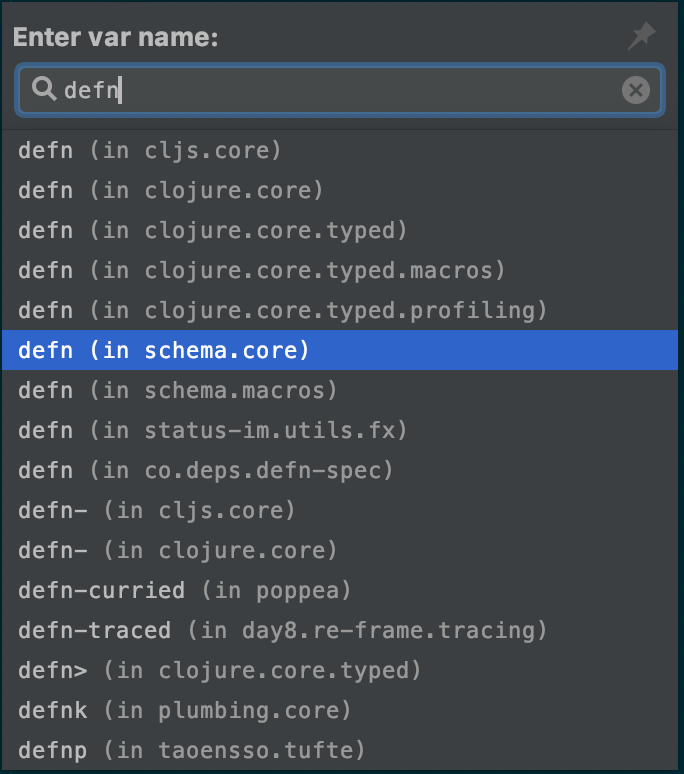

# Configuring Cursive to resolve the defn-spec macro

Cursive doesn't natively understand the defn-spec `defn` macro. However, you can use Cursive's [symbol resolution](https://cursive-ide.com/userguide/macros.html) to tell it to treat the macro like the Schema `defn` macro, which it does understand.

## Setup steps

Write a stub function using the defn-spec macro:

```clj
(ns my.ns
  (:require [net.danielcompton.defn-spec-alpha :as ds]
            ; ...
            ))

(ds/defn adder :- int? [x :- int?]
  (inc x))
```

It will show up as unresolved, and won't indent like Clojure's `defn`.


Click on the `ds/defn` text, wait for the lightbulb to appear, then click on it. Then click on "Resolve net.danielcompton [...] as..."


Then choose "Specify..."


Then choose "defn (in schema.core)"



🎉 You're all done! The `adder` function should now resolve correctly.
